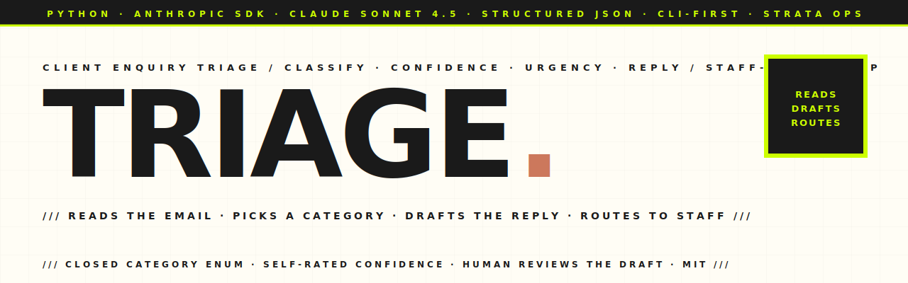

<p align="center">
  <picture>
    <source media="(prefers-color-scheme: dark)" srcset="assets-readme/hero-banner-dark.svg" />
    
  </picture>
</p>

<p align="center">
  <a href="https://github.com/hatimhtm/strata-enquiry-triage/actions/workflows/ci.yml"></a>
  
  
  
  <a href="LICENSE"></a>
</p>

<p align="center">
  <em>A small, focused CLI that turns one inbound client enquiry into a triaged, actionable record for a staff member. The <strong>Anthropic API</strong> (Claude Sonnet 4.5) reads the email, picks a category from a closed enum, rates its own confidence, scores urgency, drafts a polite reply in Australian English, and recommends a routing action. Designed for a strata-management workflow where <strong>send-without-review is not on the table</strong> — every output is a draft a human reads before it goes out. Built as the Part 1 deliverable for the Strata Management Consultants AI Developer assessment.</em>
</p>

---

### `/// WHAT IT IS`

```
┌────────────────────────────────────────────────────────────────────┐
│ INPUT                                                              │
│ ▸ One client enquiry — from --text, --file, or stdin               │
├────────────────────────────────────────────────────────────────────┤
│ PIPELINE                                                           │
│ ▸ Short-circuit: empty / whitespace → "spam_or_unclear"            │
│ ▸ Anthropic messages.create with a strict JSON-output system       │
│   prompt (closed category enum, no-invented-facts rule)            │
│ ▸ Tolerant parser — handles a stray ```json fence if the model     │
│   adds one despite instructions                                    │
│ ▸ Typed dataclass — no string-typed downstream code                │
├────────────────────────────────────────────────────────────────────┤
│ OUTPUT                                                             │
│ ▸ category    — new_client · support_request · complaint ·         │
│                 billing_question · general_question · spam_unclear │
│ ▸ confidence  — float 0.0–1.0  (self-rated, lowered on ambiguity)  │
│ ▸ urgency     — low · normal · high  (high = legal / safety /      │
│                 financial deadline / AGM date)                     │
│ ▸ sender_intent       — one-line restatement of what they want     │
│ ▸ suggested_reply     — polite AU-English draft, signed as the     │
│                         firm, never invents facts                  │
│ ▸ recommended_action  — short routing instruction for staff        │
│ ▸ flags               — needs_human_review · contains_pii ·        │
│                         ambiguous_input · out_of_scope             │
└────────────────────────────────────────────────────────────────────┘
```

---

### `/// WHY IT EXISTS`

Strata firms get a high volume of inbound emails across two or three shared inboxes — quote requests from prospective committees, ceiling-leak complaints from owners, AGM-minute requests, invoice questions, the lot. The office manager spends the first 90 minutes of every morning reading and sorting them.

This CLI does the reading and sorting. **It doesn't auto-send.** It produces a structured triage record + draft reply so a staff member can scan a queue, edit the draft, and click send — instead of writing every reply from scratch. The whole point is to free up human attention for the cases that actually need judgement.

It's a CLI deliberately. The brief asked for a small working tool, and a single-file CLI is the smallest thing that demonstrates the loop end-to-end. It also plugs into anything: an IMAP poller, a Laravel queue worker, an n8n flow, a WordPress webhook target, a Zapier "Run Command" node.

---

### `/// HIGHLIGHTS`

| | |
|---|---|
| **Closed category enum** | Six categories defined in the system prompt. Free-text labels drift (`complaint` vs `Complaint` vs `service complaint`) and break downstream routing — the enum is enforced in prose and the model is told it's the only valid set. |
| **Self-rated confidence** | The model is explicitly told to lower its confidence on ambiguous inputs. Without that rule, models will pick the closest category at 0.9 confidence even for garbage. Confidence is only useful if the model is allowed to admit uncertainty. |
| **No-invented-facts rule** | The prompt forbids inventing lot numbers, dates, dollar figures, or staff names. If information is missing, the model is told to *ask in the suggested reply* instead. This is the most expensive hallucination class in strata work and the one most prompts get wrong. |
| **Urgency scoring** | Three-level signal so staff queues can sort by `urgency == "high"` first — defined as legal exposure, safety risk, financial deadline, or AGM date. NCAT-bound complaints surface to the top instantly. |
| **Typed dataclass output** | `TriageResult` with explicit fields. Downstream code (a Laravel job, an n8n branch, a Slack message) reads `result.urgency` not `result["urgency"]`. |
| **Three layers of error handling** | (1) Empty input short-circuits before the API call. (2) `RateLimitError`, `APIConnectionError`, `APIError` each map to a distinct non-zero exit code so an orchestrator can decide whether to retry. (3) Malformed JSON from the model raises `RuntimeError` with a truncated preview. |
| **Two output modes** | `--json` for machine consumers (pipelines), no flag for a formatted human-readable box for staff use at the terminal. |
| **PII-aware flags** | `contains_pii` flag is raised so downstream automation can mask, encrypt, or restrict the record per the firm's data-handling policy. |
| **Designed to plug in** | One function deep. Wraps trivially into a Laravel queued job, an n8n HTTP node, an IMAP listener, a WordPress hook target, or a Zapier "Run Command" node. |
| **Example enquiries shipped** | `examples/new_client.txt`, `examples/complaint.txt`, `examples/gibberish.txt` — covers the happy path and the spam edge-case so a reviewer can verify end-to-end in under a minute. |

---

### `/// PROJECT LAYOUT`

```
strata-enquiry-triage/
├── triage.py                  single-file CLI — pipeline, prompt, formatter
├── requirements.txt           anthropic + python-dotenv, that's it
├── .env.example               ANTHROPIC_API_KEY scaffold
├── examples/
│   ├── new_client.txt         realistic AU committee quote request
│   ├── complaint.txt          urgent ceiling-leak complaint with NCAT threat
│   └── gibberish.txt          edge case — should return spam_or_unclear
├── .github/
│   ├── workflows/ci.yml       ruff + py-compile + import sanity check
│   └── FUNDING.yml
└── assets-readme/             brutalist banner SVGs (light + dark)
```

---

### `/// LOCAL DEV`

```bash
git clone https://github.com/hatimhtm/strata-enquiry-triage.git
cd strata-enquiry-triage
python3 -m venv .venv && source .venv/bin/activate
pip install -r requirements.txt
cp .env.example .env          # then paste your ANTHROPIC_API_KEY
export $(cat .env | xargs)

# inline text
python triage.py --text "Hi, I'd like a quote for managing a 40-lot building in Bondi."

# from a file
python triage.py --file examples/complaint.txt

# from a pipe
cat examples/new_client.txt | python triage.py

# raw JSON for piping into another system
python triage.py --file examples/new_client.txt --json
```

Sample output for `examples/complaint.txt`:

```
────────────────────────────────────────────────────────────────
  ENQUIRY  URGENT — water leak in Lot 14, no response for [...]
────────────────────────────────────────────────────────────────
  Category   : complaint  (confidence 0.94)
  Urgency    : high
  Intent     : Resolve a recurring ceiling leak before escalating to NCAT.
  Flags      : contains_pii
  Action     : Escalate to the building manager today; log NCAT-risk note.

  ── Suggested reply ──
  Hi Sarah, thank you for getting in touch and apologies for the delay
  in our response. We are treating this as urgent...
────────────────────────────────────────────────────────────────
```

---

### `/// DESIGN DECISIONS`

**Why a CLI and not a web UI.** The brief explicitly allowed CLI output and asked for a *small* working tool. A single-file CLI is the smallest end-to-end demo, and it's the easiest thing to plug into a larger workflow — Laravel `Process::run`, n8n "Execute Command", an IMAP cron job, a WordPress webhook handler. A web UI would have been more visible and less useful.

**Why Claude Sonnet 4.5.** Strong instruction-following on structured JSON, ~3× cheaper per token than GPT-4-class models for similar classification quality, and the Anthropic SDK has clean typed errors (`RateLimitError`, `APIConnectionError`) which lets the CLI return meaningful exit codes for orchestrators. For a non-conversational classification task this is the right cost/quality point.

**Prompt design — three deliberate choices.**

1. *Closed category list in the system prompt.* Free-text labels are why so many classification prompts run at ~60% accuracy in production — half the failures are the model returning `Bug Report` while the consumer expects `bug`. The enum is enforced in prose; the JSON-schema-style instruction makes the model treat it as the only valid set.
2. *Explicit `spam_or_unclear` category + an instruction to lower confidence on ambiguous inputs.* Without this the model picks the closest category at 0.9 confidence even for garbage. Confidence only earns its place if the model is allowed to admit uncertainty.
3. *No-invented-facts rule + an instruction to ask in the suggested reply when info is missing.* Otherwise the model fills in plausible lot numbers and dates, which is the worst hallucination class in this domain because it *looks* correct.

**Error handling — three layers.**
1. Empty / whitespace input short-circuits with a synthesised result, no API call burned.
2. Anthropic SDK exceptions each map to a distinct exit code: `3` for transient (rate limit, connection) so an orchestrator retries, `4` for parse failure so it doesn't.
3. Malformed JSON from the model raises `RuntimeError` with a truncated preview of the bad output — easier to debug than "something failed."

**No retries on the model call.** Sonnet returns valid JSON ≈99.9% of the time with this prompt shape. If it fails twice the input is almost certainly the problem; better to surface the error and let a human look than burn budget on five retries.

---

### `/// AUTOMATION POTENTIAL`

The CLI is intentionally one function deep so it can become:

- **A Laravel queued job.** `Process::run(['python', 'triage.py', '--json'], input: $email->body)`, parse JSON, write to the `enquiries` table, fire a Slack webhook on `urgency == "high"`. Horizon handles retries and concurrency.
- **An n8n / Make node.** "Execute Command" → JSONPath extractors → branch on `urgency`. The whole flow is six nodes.
- **An IMAP listener.** Poll `enquiries@strata...` every 60 seconds, triage each new message, leave the suggested reply as an Outlook draft for staff review. Hardest part is the IMAP polling; the AI layer is unchanged.
- **A WordPress webhook target.** Gravity Forms / Fluent Forms `fluentform/submission_inserted` hook POSTs the payload to a small Flask wrapper that calls this CLI and returns the JSON. Staff get the notification via `wp_mail()`.
- **A Zapier "Run Command" step.** For non-technical operators who want to own the workflow themselves.

---

### `/// LICENSE`

[MIT](LICENSE). Fork it, swap the system prompt for your own taxonomy, point it at any LLM provider (the SDK call is the only thing that changes), and re-skin it for support tickets, lead routing, intake forms, or any other "one message in → structured action out" workflow.

---

<p align="center">
  <a href="https://hatimelhassak.is-a.dev"></a>
  <a href="https://cal.com/hatimelhassak/engineering-discovery"></a>
  <a href="https://www.linkedin.com/in/hatim-elhassak/"></a>
  <a href="mailto:hatimelhassak.official@gmail.com"></a>
</p>

<p align="center">
  <code>///&nbsp;&nbsp;OPEN FOR NEW WORK&nbsp;&nbsp;///&nbsp;&nbsp;CONTRACT &amp; FREELANCE&nbsp;&nbsp;///&nbsp;&nbsp;REMOTE WORLDWIDE&nbsp;&nbsp;///</code>
</p>
